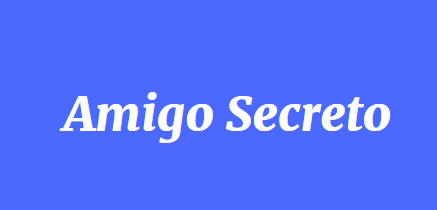

# Challenge Juego Amigo Secreto - ONE Alura Latam

## Índice

1. Descripción
2. Estado del Proyecto
3. Demostración de funciones y aplicaciones
4. Acceso al Proyecto
5. Tecnologías utilizadas
6. Personas Contribuyentes
7. Personas Desarrolladoras del Proyecto
8. Licencia

## Descripción del Proyecto
Este es un programa para sortear un amigo imaginario. Se introducen nombres de amigos y luego se selecciona uno de la lista aleatoriamente.

## Estado del proyecto
Finalizado.

## Instrucciones
1. Escriba el nombre de un amigo en el campo de texto

2. Haga click en "añadir" para agregar el nombre a la lista

Los nombres irán apareciendo en la lista

3. Repetir pasos 1 y 2 hasta agregar todos los nombres deseados

4. Haga click en "Sortear amigo"

5. El nombre sorteado aleatoriamente aparecerá en verde

## Enlace al Proyecto
[GitHub del Proyecto](https://jpdjcp.github.io/Amigo-Secreto---Challenge-ONE/)

## Tecnologías utilizadas
- HTML
- CSS
- JavaScript

## Personas Contribuyentes
Equipo de Alura Latam

## Personas Desarrolladoras del Proyecto
Marcelo Palacios

[GitHub](https://github.com/jpdjcp)

## Licencia
Licencia de código abierto.